# Bitácora de verificación manual

Evidencia general de que las features funcionan corriendo de verdad en un
emulador/dispositivo (no solo en tests automatizados), y cómo reproducir esa
verificación. Complementa el `CHANGELOG.md` (que documenta el código) con
capturas y el procedimiento — no es un registro de una máquina o sesión en
particular, sino algo que cualquiera debería poder repetir.

---

## Cómo reproducir: 2 emuladores en red real (host + cliente)

No hace falta ningún truco de red manual: dos emuladores modernos de Android
Studio comparten una red WiFi virtualizada (`netsimd`) y se descubren solos
por el UDP broadcast real de `MdnsAdvertiser`/`MdnsDiscoverer`. Se probó primero
el truco `adb forward tcp:8765 tcp:8765` + IP manual `10.0.2.2` y falló
("Connection closed before full header was received") — no hacía falta,
era una complicación innecesaria.

```bash
# 1. Ver qué dispositivos/emuladores hay disponibles
flutter devices

# 2. Lanzar la app en cada uno, uno detrás de otro (NO en paralelo, para no
#    pisar la caché de build compartida)
flutter run -d <serial-emulador-1> --no-hot   # será el host
flutter run -d <serial-emulador-2> --no-hot   # se unirá a la sala

# 3. Emulador 1 → Home → "Crear sala"
# 4. Emulador 2 → Home → "Unirse a sala" → aparece sola en la lista
#    (descubrimiento UDP real entre emuladores, sin IP manual)
# 5. Emulador 2 → tocar "Ready"
# 6. Emulador 1 (host) → "Start Game" (se habilita solo con 2+ listos)
```

Capturar pantalla de cualquiera de los dos en cualquier momento:

```bash
ADB=/home/user/Android/Sdk/platform-tools/adb
$ADB -s <serial> exec-out screencap -p > captura.png
```

Si un `flutter run` anterior quedó colgado o un dispositivo tiene la app en un
estado raro, limpiar antes de repetir:

```bash
pkill -f "flutter_tools.snapshot run"
adb -s <serial> forward --remove-all
adb -s <serial> shell am force-stop com.zenxlk.exploding_kittens
```

---

## Fase 4, Paso 3 — GameScreen conectado (verificado 2026-07-07)

Verificado con dos emuladores Android (uno como host, otro como cliente) en
red real, sin mocks. Ver comandos arriba para reproducir.

1. Home arranca sin errores.
   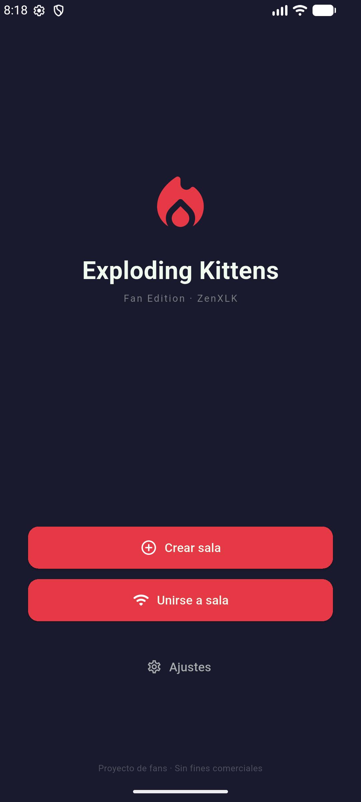
2. Lobby del host recién creado, esperando jugadores (1/5).
   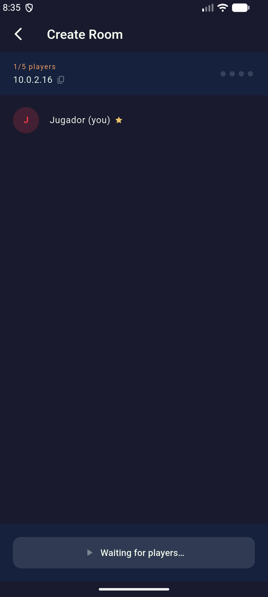
3. El segundo jugador se une por descubrimiento UDP real; ambos "Ready" (2/5).
   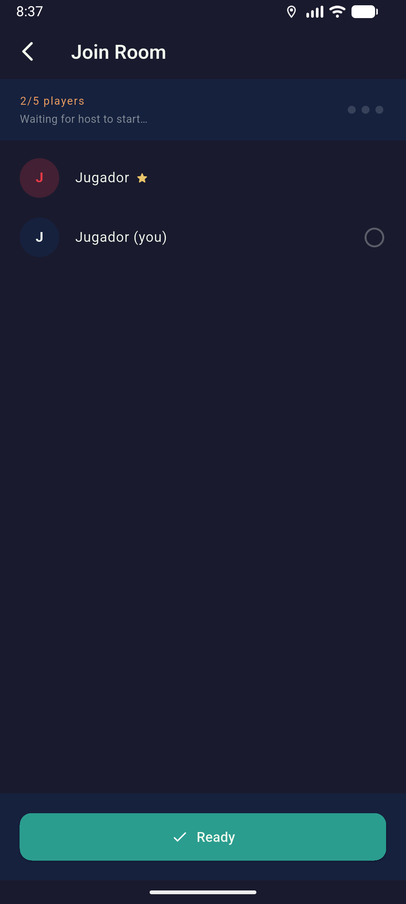
4. El host arranca el `GameEngine` real: HUD con ambos jugadores, mazo (35
   cartas), descarte vacío, mano propia con los placeholders de `CardVisuals`
   (colores/iconos por tipo de carta).
   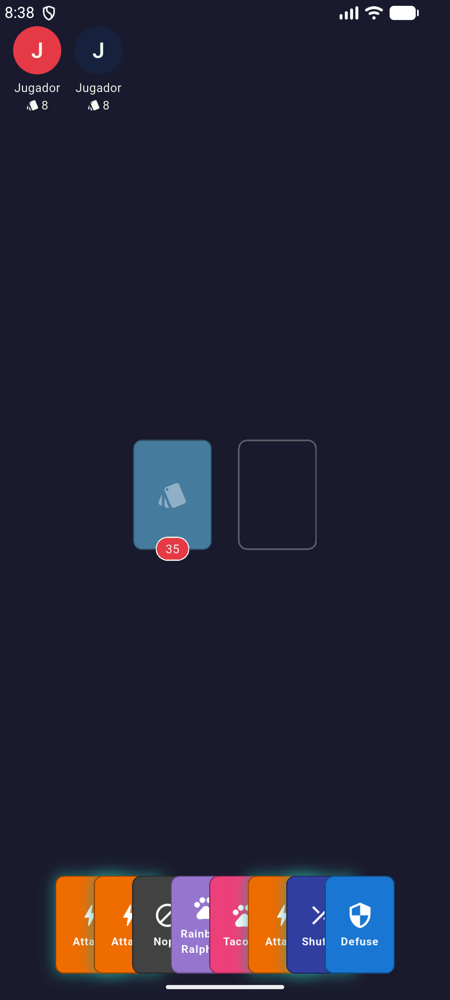
5. El jugador no-host ve el placeholder honesto de espera — la sincronización
   real por red es Fase 5, todavía no implementada, y no se simula.
   
6. Tras tocar el mazo: robó de verdad (mazo 35→34, mano 8→9), el turno avanzó
   y el HUD resalta al siguiente jugador.
   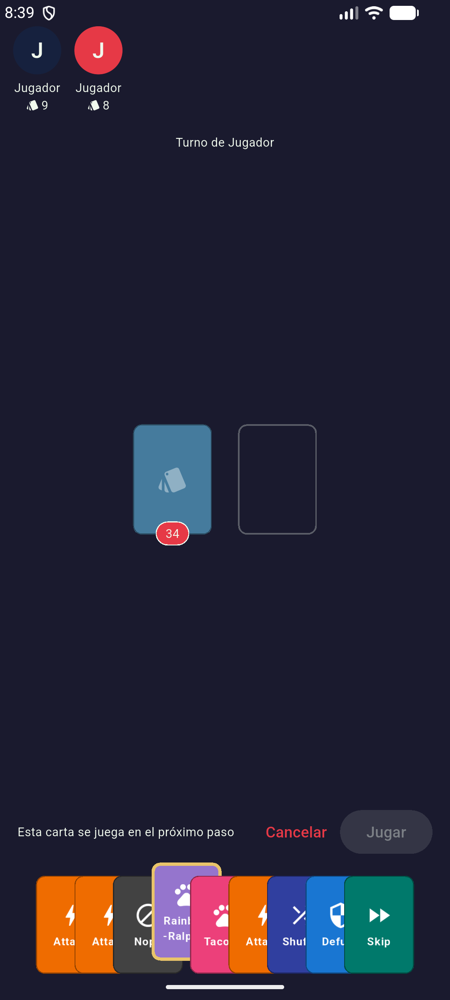

**Confirmado funcionando de punta a punta:** crear/unir sala por red real,
arranque del engine, render de la mesa con datos reales, robar carta,
selección de carta con aviso de "se juega en el próximo paso" para las que
aún no tienen overlay (Favor/pares-tríos/Nope/Defuse), avance de turno.

**Límite conocido y esperado, no un bug:** en cuanto el turno pasa al jugador
no-host, la partida queda parada ahí porque ese dispositivo todavía no puede
actuar — es exactamente el hueco de Fase 5 (sincronización por red), no una
falla de esta sesión de trabajo.

---

## Fase 4 — SeeTheFuture, FavorTarget y NopeWindow (verificado 2026-07-08)

Verificado con dos emuladores Android reales (host + cliente), red real,
sin mocks, jugando una partida real de principio a lo que permite el límite
de Fase 5.

**Nota de entorno — el descubrimiento UDP no funcionó esta vez:** a
diferencia de la sesión del 2026-07-07 (ver más arriba), esta vez cada
emulador reportó su propio `wlan0` con la misma IP `10.0.2.16/24` — no
comparten red virtual, así que `MdnsDiscoverer` no encontró nada
("No rooms found yet" indefinidamente) y conectar a esa IP directamente
también falló (`Connection refused`, cada emulador es su propia red
aislada). Solución que sí funcionó: un puente manual con `adb`
(sustituye al descubrimiento/IP directa solo para pruebas, no algo que la
app deba hacer distinto):
```bash
ADB=/home/user/Android/Sdk/platform-tools/adb   # ajustar a tu instalación
$ADB -s <serial-host>   forward tcp:8765 tcp:8765   # PC:8765 -> host:8765
$ADB -s <serial-cliente> reverse tcp:8765 tcp:8765   # cliente:8765 -> PC:8765
# En el cliente, "Enter IP manually" -> 127.0.0.1 -> Connect
```
Puede que dependa de cómo se hayan arrancado los emuladores en cada
máquina (versión de imagen, flags de red); no se investigó la causa raíz
porque no es código del proyecto.

1. Sala creada y unida (con el puente de arriba), ambos "Ready", partida
   arrancada: HUD real con 2 jugadores, mazo de 35 cartas, mano propia con
   8 cartas reales (sin `assetPath`, cae al placeholder de `CardVisuals`
   como se esperaba — `assets/cards/` sigue vacío).
   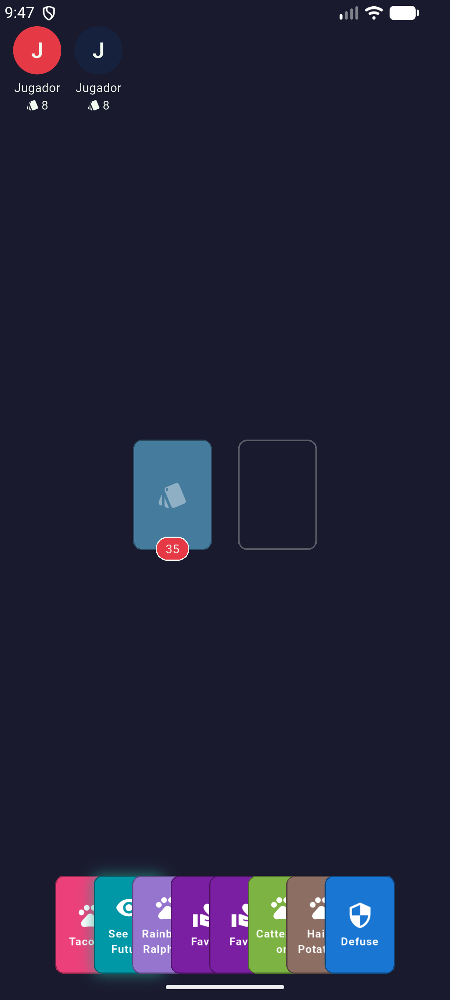
2. **`SeeTheFutureOverlay`**: seleccionar la carta, "Jugar" → aparece el
   overlay con las 3 cartas de arriba reales del mazo (Attack,
   Rainbow-Ralphing, Bearded Dragon) y fundido de entrada (`flutter_animate`)
   visible. "Continuar" la cierra y la carta pasa al descarte.
   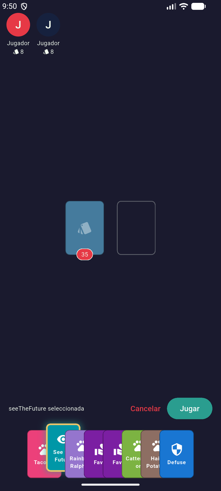
3. **`FavorTargetOverlay`**: seleccionar Favor, "Elegir objetivo" → aparece
   el único rival listado. Tocarlo dispara la acción.
   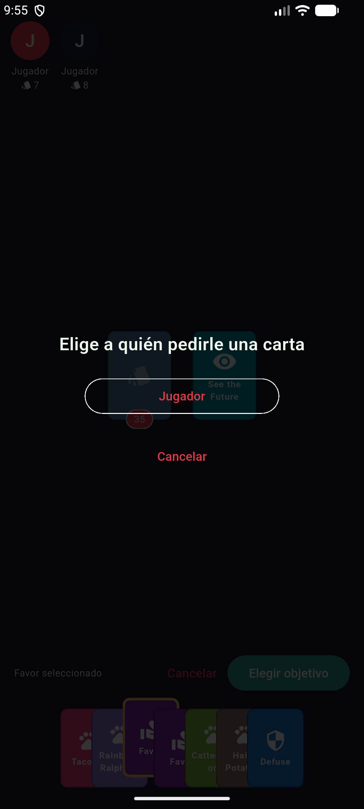
4. **`NopeWindowOverlay`**: jugar Favor abre la ventana de verdad — barra de
   progreso corriendo (`GameConstants.nopeWindowMs`), texto "Cualquiera
   puede cancelar esto con un Nope", botón "¡Nope!" **deshabilitado**
   correctamente porque la mano local no tenía ninguna carta Nope en ese
   momento.
   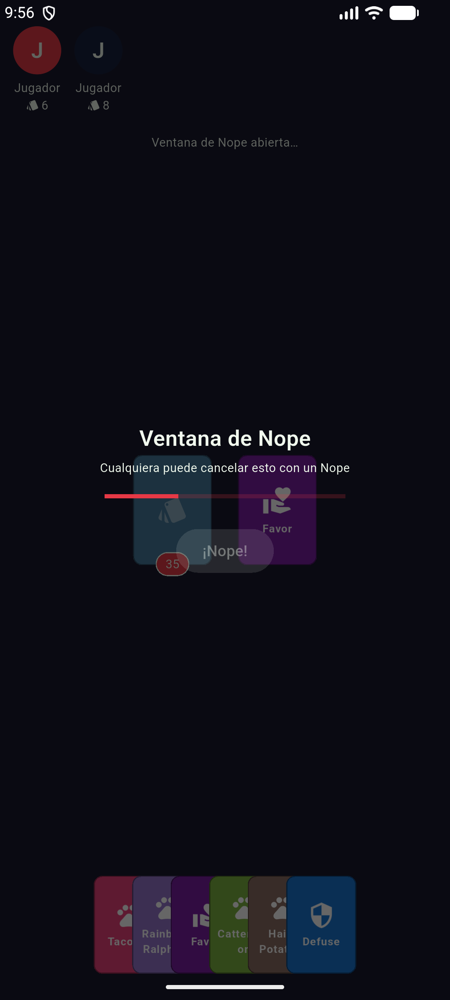
5. Tras los ~3s, la ventana se cerró sola y el Favor se resolvió de verdad:
   robó una carta al azar del rival (su mano bajó de 8→7, la mía subió de
   6→7) — una `See the Future` nueva apareció en mi mano con su glow de
   jugable (pop de escala de `flutter_animate` incluido).
   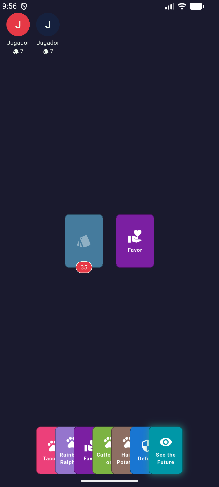
6. Seguí robando: la única carta normal robada (Attack) **terminó mi
   turno** y pasó al no-host, que quedó bloqueado en el placeholder de
   siempre — confirmado que el límite de Fase 5 aplica igual con el puente
   `adb` que con descubrimiento real.
   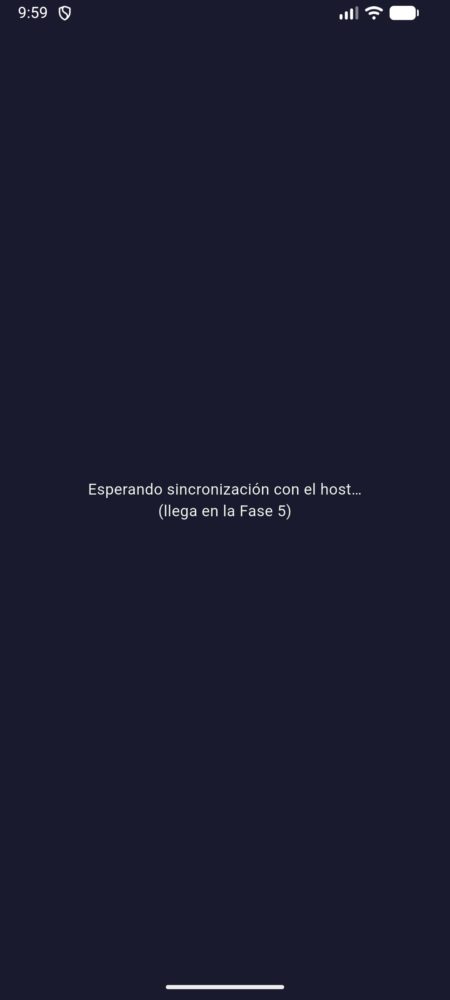

**Confirmado funcionando de punta a punta, sin excepciones ni crashes en
los logs de `flutter run` de ninguno de los dos dispositivos:**
`SeeTheFutureOverlay`, `FavorTargetOverlay`, `NopeWindowOverlay` (barra,
botón deshabilitado, auto-resolución correcta de Favor no nopeado),
transiciones de `flutter_animate` en overlays y en el pop de cartas
jugables.

**No verificado en esta pasada (bloqueado por el límite de Fase 5, no por
falta de intento):** `InsertBombOverlay`, `ExplosionOverlay` y
`GameOverScreen` necesitan que el jugador activo robe una Exploding
Kitten — con 2 dispositivos reales solo el host puede actuar, así que solo
hay **un intento** por partida (el primer robo del host) antes de que el
turno pase al no-host y la partida quede bloqueada; no salió la bomba en
ese intento. Probarlos de verdad requiere Fase 5 (para que el no-host
también pueda jugar) o el modo bot/offline de Fase 6 (para poder seguir
jugando ambas manos desde el host). Tampoco se verificó audio (necesita
oídos, no capturas).

---

## Fase 4 — NopeWindowOverlay: jugar un Nope de verdad (pendiente)

La barra, el auto-cierre y el botón deshabilitado ya se verificaron de punta
a punta (ver sección de arriba, 2026-07-08). Lo único que falta específicamente:
tocar "¡Nope!" **teniendo** una carta Nope en mano y confirmar que se
descarta, la barra se reinicia desde el principio (nueva vuelta de la
cadena) y, si queda en número par, el efecto original SÍ se aplica. No se
dio el caso en la partida jugada esta sesión (la mano local no tenía Nope
en ese momento).

Limitación conocida: como hoy solo el host corre el `GameEngine` real (Fase 5
pendiente), probar que *otro* jugador cancele la carta requiere que ese mismo
dispositivo host controle temporalmente la mano de ambos jugadores o esperar
a la sincronización por red.

---

## Fase 4 — InsertBombOverlay (pendiente de verificación manual)

Sí se intentó en la sesión del 2026-07-08 (ver sección de arriba con las
capturas reales) pero no salió la bomba en el único robo que el host
alcanzó a hacer antes de que el turno pasara al no-host y la partida se
bloqueara — con 2 dispositivos reales solo hay un intento por partida.
Pasos para cuando se quiera reintentar (con más paciencia, o repitiendo la
partida varias veces):

1. Como host, robar cartas hasta sacar una Exploding Kitten teniendo un
   Defuse en mano (o forzarlo colocando el mazo a mano si se quiere apurar
   la prueba).
2. Confirmar que aparece el overlay "¿Dónde escondes la bomba?" con un
   slider entre "Arriba del todo" y "Abajo del todo".
3. Mover el slider y confirmar con "Esconder bomba": el mazo debe quedar con
   la misma cantidad de cartas de antes de robar (la bomba se reinsertó, no
   desapareció ni se duplicó) y el turno debe avanzar al siguiente jugador.
4. Repetir eligiendo la posición 0 (arriba del todo) y volver a robar de
   inmediato en el siguiente turno propio: debe salir la misma bomba otra
   vez.

Limitación conocida: igual que con `NopeWindowOverlay`, verificar el punto de
vista del jugador no-host (que solo debería ver "Esperando a que \<jugador\>
esconda la bomba…") requiere Fase 5 o controlar ambas manos desde el host.

---

## Fase 4 — ExplosionOverlay (pendiente de verificación manual)

Mismo intento y misma limitación que `InsertBombOverlay` arriba (un solo
robo posible por partida con 2 dispositivos reales; no salió la bomba).
Pasos:

1. Como host, robar cartas hasta sacar una Exploding Kitten **sin** tener
   Defuse en mano.
2. Confirmar que aparece el overlay "¡BOOM!" con el nombre del jugador
   eliminado, y que se cierra solo (sin tocar nada) después de ~1.6s.
3. Confirmar que el HUD (`PlayersHudWidget`) refleja al jugador como
   eliminado (atenuado) una vez cerrado el overlay, y que el turno pasó al
   siguiente jugador vivo.
4. Si era el único jugador que quedaba vivo aparte del ganador, confirmar
   que tras el overlay se navega a `GameOverScreen`.

---

## Fase 4 — GameOverScreen (pendiente de verificación manual)

Tampoco se corrió en emulador en esta sesión. Pasos:

1. Terminar una partida de 3+ jugadores (jugar hasta que solo quede uno
   vivo) y confirmar que se navega solo a `GameOverScreen` con el nombre
   del ganador y el conteo de turnos.
2. Confirmar que el ranking lista primero al ganador y luego a los
   eliminados en orden **inverso** al que explotaron (el penúltimo en
   quedar vivo aparece 2º, el primero en explotar aparece último).
3. Como host, tocar "Revancha": debe volver a `GameScreen` con una partida
   nueva (mazo repartido de cero) usando los mismos jugadores de la sala.
4. Confirmar que un jugador no-host en la misma pantalla no ve el botón
   "Revancha", solo el mensaje de espera.

---

## Fase 4 — audioplayers: efectos y música (pendiente de verificación manual)

Este es el primer punto de esta sesión donde SÍ importa correr la app de
verdad — los tests con fake `IAudioService` no prueban que `audioplayers`
reproduzca los archivos reales en un dispositivo/emulador. Pasos:

1. En Ajustes, confirmar que "Efectos de sonido" y "Música" (con su
   volumen) están activados, y entrar a una partida.
2. Confirmar que suena `music_ingame.mp3` en loop apenas entra `GameScreen`.
3. Robar una carta (debe sonar `draw_card.mp3`), jugar Attack (`atack.mp3`,
   distinto del resto de cartas que suenan `play_card.mp3`), barajar con
   Shuffle (`shuffle_deck.mp3`).
4. Provocar una ventana de Nope y jugarlo: debe sonar `nope.mp3`.
5. Robar una Exploding Kitten: debe sonar `explode.mp3` una sola vez (no
   dos), tanto si se defusa como si elimina al jugador. Al defusar, además
   debe sonar `countdown.mp3` (clip prestado, no hay uno propio todavía).
6. Terminar la partida: debe sonar `win.mp3` y, en `GameOverScreen`, música
   `music_gameover.mp3` en loop reemplazando a la de partida.
7. Cambiar volumen/activar-desactivar sonido o música desde Ajustes
   **mientras la partida sigue abierta** (sin salir de `GameScreen`) y
   confirmar que el cambio se aplica sin tener que reiniciar la pantalla.
8. Si algo no suena, revisar la consola en busca de logs
   `[W][AudioService]` — la app no debe crashear ni bloquearse por un
   fallo de audio.

---

## Fase 4 — flutter_animate en cartas y overlays (verificado parcialmente 2026-07-08)

El fundido de entrada se confirmó de verdad en `SeeTheFutureOverlay`,
`FavorTargetOverlay` y `NopeWindowOverlay` durante la partida real jugada
esta sesión (ver capturas más arriba) — no se sintió lento ni bloqueó la
interacción. Falta confirmar específicamente:

1. El "pop" de escala en una carta jugable (Attack/Skip/Shuffle/See the
   Future) al aparecer — se vio el glow correctamente pero no se prestó
   atención al pop de entrada en sí durante la sesión.
2. El fundido en `InsertBombOverlay` y `ExplosionOverlay` (bloqueados, ver
   secciones de arriba).

**Fase 4 — Pantalla de juego completa: cerrada en código, verificada en
buena parte en la práctica (2026-07-08).** `SeeTheFutureOverlay`,
`FavorTargetOverlay` y `NopeWindowOverlay` confirmados de punta a punta en
2 emuladores reales, sin crashes. Lo que sigue sin poder probarse con el
alcance actual de la app (2 dispositivos reales, sin bots): jugar un Nope
de verdad, `InsertBombOverlay`, `ExplosionOverlay` y `GameOverScreen` —
todos requieren que la partida llegue a una Exploding Kitten o a un
ganador, y con 2 dispositivos reales el no-host se bloquea apenas pasa su
turno (límite de Fase 5 ya documentado, no un bug nuevo). Probarlos de
verdad de forma práctica necesita Fase 5 (para que el no-host también
pueda jugar) o el modo bot/offline de Fase 6 (para seguir jugando ambas
manos desde el host sin depender de la suerte del mazo). Audio tampoco se
verificó (necesita oídos, no capturas).

---

## Fase 5 — Red y reconexión (verificado 2026-07-11)

Verificado en 2 emuladores reales (`emulator-5554` host, `emulator-5556`
cliente), a pedido explícito del usuario (excepción puntual a
[[feedback_manual_testing]]). Descubrimiento UDP funcionó de entrada esta
sesión (misma red virtual `netsimd`, sin necesitar el puente
`adb forward`/`adb reverse` de la sección de Fase 4).

### Confirmado funcionando de punta a punta

1. **El no-host ya juega la partida real** — apenas arranca la partida ve
   su propia mano y la mesa real, no el placeholder fijo de Fase 4
   ("Esperando sincronización con el host…"). Captura:
   `docs/screenshots/fase5/01_no_host_ve_mesa_real.png`.
2. **Sincronización de estado en ambos sentidos** — se jugaron ~35 turnos
   alternando quién robaba/jugaba desde cada dispositivo; mazo, manos y
   turno se reflejaron casi al instante en el otro dispositivo en cada
   ronda. El no-host jugó una carta `See the Future` y el
   `SeeTheFutureOverlay` se disparó correctamente tras el viaje
   cliente→host→broadcast. Captura:
   `docs/screenshots/fase5/02_no_host_juega_see_the_future.png`.
   - Hallazgo menor (preexistente de Fase 4): el overlay de `SeeTheFuture`
     se le mostraba a **ambos** jugadores, no solo a quien lo jugó — era
     fiel al `GameState.seeTheFutureCards` compartido tal cual ya
     funcionaba en un solo dispositivo. **Arreglado** en `dev/gameplay-fixes`
     filtrando el overlay por turno en `GameTableView` (el dato en sí
     sigue viajando compartido en `GameState`, sin canal privado por
     jugador — ver `docs/GAME_RULES.md`).
3. **`InsertBombOverlay`/`ExplosionOverlay` en el no-host** — bloqueados
   desde Fase 4, ya confirmados: el no-host robó la Exploding Kitten, se
   le mostró `InsertBombOverlay`, y mientras tanto el host vio "Esperando
   a que Jugador esconda la bomba…". Capturas:
   `docs/screenshots/fase5/03_insert_bomb_overlay_no_host.png`,
   `docs/screenshots/fase5/04_host_esperando_defuse.png`.
4. **`GameOverScreen` sincronizado en ambos dispositivos** — el no-host
   explotó sin Defuse en un intento posterior (partida de 2 jugadores) y
   el juego terminó automáticamente; ambos dispositivos mostraron el mismo
   ranking, y el botón "Revancha" solo apareció en el host. Antes de esta
   fase el no-host se quedaba con "no hay ningún resultado de partida"
   para siempre. Capturas:
   `docs/screenshots/fase5/05_gameover_sincronizado_no_host.png`,
   `docs/screenshots/fase5/06_gameover_host_con_revancha.png`.
5. **Grace period + eliminación por desconexión, extremo a extremo** — se
   forzó el cierre completo de la app (`am force-stop`) en el no-host a
   mitad de partida. El host mostró de inmediato "Reconectando…" con
   icono de wifi apagado en `PlayersHudWidget`
   (`docs/screenshots/fase5/07_reconectando_ui.png`). Al dejar pasar los
   60s (`GameConstants.reconnectTimeoutSeconds`) sin que el jugador
   volviera, se le eliminó automáticamente y — al ser partida de 2 — el
   host pasó solo a `GameOverScreen` como ganador
   (`docs/screenshots/fase5/08_timeout_elimina_termina_partida.png`).
   Pipeline completo: `WsServer.onPlayerDisconnected` →
   `ReconnectionManager.trackDisconnect` →
   `GameNotifier.markPlayerDisconnected` (broadcast) → expira sin volver →
   `eliminateForDisconnect` → `WinCondition` → `GameFinished`.
6. Consola de ambos dispositivos sin excepciones ni crashes durante toda
   la sesión.

### Bugs encontrados y arreglados en esta sesión

- **Rematch no navegaba al no-host** — al tocar "Revancha" en el host, el
  no-host se quedaba varado en `GameOverScreen` mostrando "No hay ningún
  resultado de partida" en vez de pasar a la partida nueva. Causa: el host
  navega manualmente en `_rematch()`, pero nada disparaba la navegación
  del lado del no-host cuando `remoteGameProvider` dejaba de estar en
  `GameFinished`. Arreglado con un `ref.listen<GameSessionState>(remoteGameProvider, ...)`
  en `GameOverScreen` que navega a `RouteNames.game` en cuanto pasa a
  `GameRunning`. Verificado con una segunda revancha tras el fix: ya
  navegó correctamente. Commit `fix(features): navigate non-host to
  GameScreen when host starts a rematch`.

### Hallazgo pendiente (no arreglado esta sesión — fuera del alcance de Fase 5)

- **Recrear una sala sin salir de la anterior dentro de la misma sesión de
  app deja un "servidor fantasma"**: tras terminar una partida y tocar
  "Volver al menú" (que solo navega a Home, no llama a
  `lobbyProvider.notifier.leaveRoom()`), crear una sala nueva reutiliza el
  mismo `LobbyRepository` sin cerrar el `WsServer` anterior. El síntoma
  observado: el cliente se unía y veía "2/5 jugadores, listo ✓", pero el
  host se quedaba viendo "1/5, esperando jugadores" indefinidamente — el
  join nunca le llegaba. Reproducido de forma consistente; se resolvió
  para continuar las pruebas force-cerrando ambos procesos y empezando de
  cero (que sí sincronizó correctamente, confirmando que no era un
  problema del protocolo en sí). Es un bug real del ciclo de vida del
  lobby (Fase 3), no de la sincronización de Fase 5 — candidato para
  arreglarlo haciendo que las salidas de sala fuera de un flujo explícito
  (p. ej. "Volver al menú" en `GameOverScreen`) llamen a `leaveRoom()`
  antes de navegar. No se tocó en esta sesión por estar fuera del alcance
  específico que se estaba verificando.

### Nota de entorno

- `adb shell svc wifi disable`/`enable` en el cliente **no cortó
  realmente** la conexión TCP hacia el host en este entorno de
  emuladores — la app siguió jugando con normalidad pese al ícono de wifi
  apagado en la barra de estado. La red virtual subyacente (`netsimd`) no
  depende del estado "wifi" reportado por el framework Android. No sirve
  como método para simular una caída de red real en este entorno; usar
  `am force-stop` (caída total del proceso, prueba el grace period +
  eliminación) en su lugar. La reconexión automática del `WsClient` con
  back-off (sin matar el proceso) ya está cubierta de forma determinística
  por el test de integración real en loopback
  (`test/network/websocket/ws_server_client_test.dart`), no dependiente de
  las particularidades de red de un emulador.
